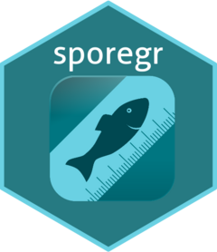

# Package sporegr
# sporegr 

This package will help you Work with data from the Spöreg mobile app. The package contains
functions to read (and do some cleanup) of data files exported from predefined queries in APEX (datastore).

I also contains rmarkdown templates for some reports. 
This package is probably not useful for the general public.

To install try remotes::install_github("kagervall/sporegr", build_vignettes = TRUE)
